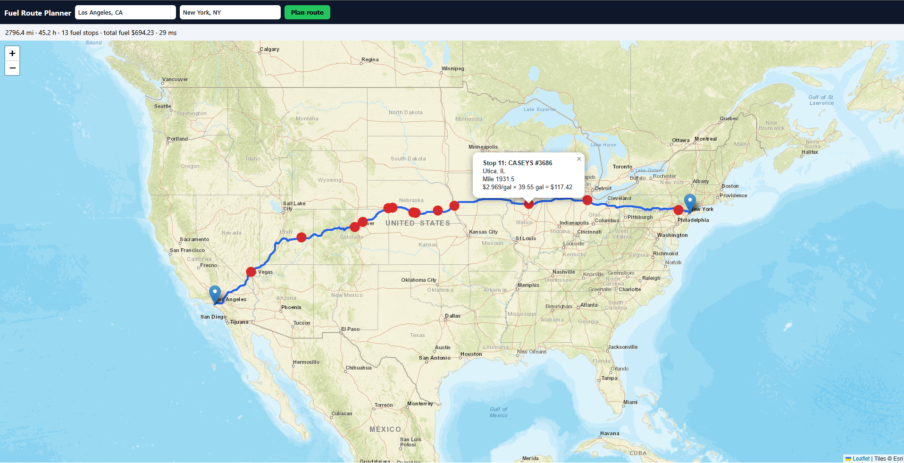
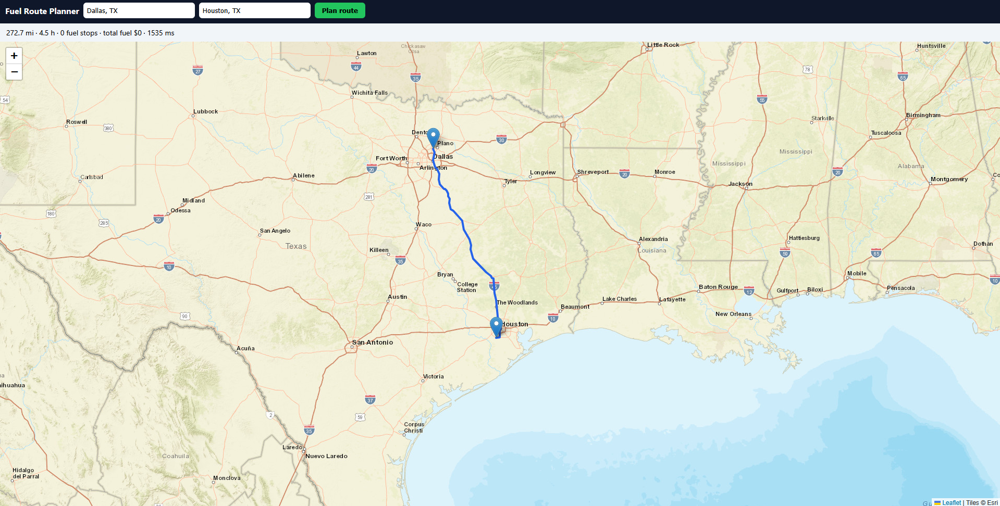

# Fuel Route API

A Django API that takes a start and finish location in the USA and returns the driving route, the cheapest places to fuel up along the way, and the total fuel cost.

The vehicle has a 500-mile range and does 10 miles per gallon, so a long trip needs several fuel stops. My goal was to choose those stops to keep the total cost as low as possible, while keeping the API fast and using as few calls to the routing service as I could.


### Route with fuel stops (Los Angeles to New York)
[](screenshots/la_ny.png)

### Short trip with no fuel stops (Dallas to Houston)
[](screenshots/dallas_houston.png)

## Running it

```bash
python -m venv .venv && source .venv/bin/activate
pip install -r requirements.txt
cp .env     # paste your free OpenRouteService key into .env
python manage.py runserver
```

Then:
- **API:** `GET /api/route/?start=Los Angeles, CA&finish=New York, NY`
  (POST with JSON `{"start": "...", "finish": "..."}` also works)
- **Map page:** open `http://127.0.0.1:8000/`
- **Tests:** `python manage.py test`

Free routing key at https://openrouteservice.org/dev/#/signup.
## What the API returns

The response includes the total distance and drive time, each fuel stop in order (station, price per gallon, gallons bought, cost and where it sits along the route), the total fuel cost, and the route as GeoJSON so a map can draw it. Bad input returns a clear 400 error instead of crashing.


## Assumptions and trade-offs

- The truck **starts with a full tank**, and the total cost covers fuel bought at the listed stops. So a trip under 500 miles has no stops and costs $0.
- The CSV has no coordinates, so station locations are **city-level**. That's why I match stations within 10 miles of the route.
- A fresh trip takes a few seconds, mostly the routing API. A repeated trip comes from the cache.
- Canadian stops and cities I couldn't match were left out, since the trip is USA-only.

## What I'd improve next

- Geocode each station's exact address once, so locations are precise instead of city-level.
- Use live fuel prices instead of a static file.
- Make the starting fuel level configurable.
- Use a shared cache such as Redis and run behind Gunicorn for production.

